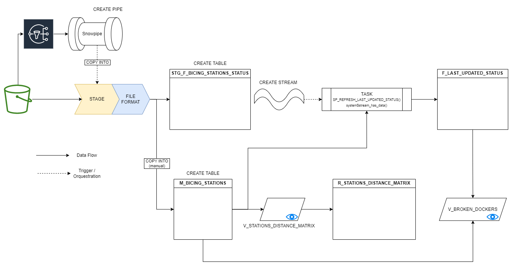

# Real time workshop

## Overview

This workshop is designed to provide hands-on experience with real-time data processing using Snowflake and Streamlit. The use case we will work with extracts real-time Bicing data, loads it to an S3 bucket, then Snowflake consumes it and transforms this data to serve a Streamlit. The final product is a real-time dashboard that indicates which stations need repair and what path should the Bicing truck follow in order to have availability of free docks and bikes. Here is a simple diagram to understand at a high level the data pipeline:

<p align="center">

</p>

## Crash course on real time data processing

Before starting to build our app, let's briefly define and explain some context that characterize event-driven architecture and the main difference between batch processing and real-time data processing.

### What is an event?

In the context of real-time data processing, an event refers to a specific occurrence or happening that takes place within a system or application. It represents a significant change or action that triggers the processing and analysis of data. Events can be generated by various sources such as user interactions, sensor readings, or system notifications. They typically contain relevant information about the event itself, such as timestamps, data payloads, and metadata. Real-time data processing systems are designed to capture, process, and respond to these events in a timely manner, enabling organizations to make informed decisions and take immediate actions based on the incoming data.

### What is real-time data processing?

Real time data processing is processing data as it is generated. In opposition to batch processing --where data is accumulated, and processed periodically (daily, hourly...)-- real-time data processing involves the continuous ingestion, transformation and loading of data. When data is generated we model it as an event, and using systems that are capable of reading and communicate events from and to other systems, we are able to implement such applications

## Brief explanation of Snowflake concepts

Here are some definitions of Snowflake objects and concepts that will be useful when following this tutorial. Feel free to revisit this definitions anytime during the workshop.

### Basic Stuff:

* **Database**: A container for schemas, tables, and other database objects.
* **Schema**: A logical container for database objects such as tables, views, and procedures.

### Things Used in the Ingestion Phase:

* **Stage**: A pointer to an external location (like AWS S3 or Azure Blob Storage) where data files are loaded for ingestion into Snowflake.
* **File Format**: Defines how structured data files are interpreted during ingestion (e.g., CSV, JSON, Parquet).
* **COPY INTO Statement**: A SQL command used to load data from a stage into Snowflake tables efficiently.
* **Snowpipe**: Snowpipe is a continuous data ingestion service in Snowflake that automatically loads new data files from an external stage (such as AWS S3 or Azure Blob Storage) into Snowflake tables as soon as the files are available. 
* **Pipe**: A mechanism that automatically copies data from a given stage into a given table using a COPY INTO command.

### Objects Used in the Transformation Pipeline:

* **Stream**: A continuous record of changes (inserts, updates, deletes) made to a table, used for CDC (Change Data Capture) operations.
* **Task**: A unit of work scheduled or executed in Snowflake, often used to automate data transformations or management tasks.
* **Stored Procedure**: A precompiled collection of SQL statements that can be stored and executed within Snowflake, facilitating complex data operations and logic.

## Steps to Follow

Now that we have a grasp of some theroy, let's start building our application to process and activate Bicing data.

### Snowflake

1. **Create a Snowflake Free Account**: Before getting started, you need to create a Snowflake free account. Visit the [Snowflake website](https://www.snowflake.com/) and sign up for a free account if you don't have one already. Once you have your account provisioned, we can start to run the scripts in the next section.

2. **Run the setup and pipeline scripts**: all the SQL code necessary to build our app can be found in `/sql_scripts`.

    - `00_setup.sql`: create the database structure and change to SYSADMIN role.
    - `01_ingest_pipeline.sql`: create and configure various objects to build the ingestion pipeline that will continuously load data from S3 to Snowflake. Also ingest the static master data to the final msater table.
    - `02_transform.sql`: finally, create the final step of the pipeline where we transform the data we have loaded to serve the streamlit application.

3. **Create the views that will feed the application**: in order to simplify the application code (it's a simple streamlit front) we will create a couple of views that will store the logic to obtain our data modeled in the way the application will use it.

    - `11_V_BROKEN_DOCKERS.sql`: This view compares the total number of docks from the master data to the total number of bikes and free docks available at each station. This will be used to show which stations need dock repair.
    - `12_V_STATIONS_DISTANCE_MATRIX.sql`: This view computes the distance between all pair of stations. This script saves this data into a new table to avoid computing the distances each time.

**Bonus**: here we have a detailed diagram that pictures all the objects we just created and their relations.

<p align="center">

</p>

### Streamlit

Setting up the Streamlit account to have your own version of the app may take more steps as you need to connect your Streamlit account to your GitHub's.

1. **Create a Streamlit Account**: To visualize and interact with the real-time data, you will create a Streamlit account. First visit the [Streamlit website](https://www.streamlit.io/) and sign up for an account. Connect using your Github account.

2. **Fork this repository**: If you want to deploy the code in `front.py` in your streamlit account you need to own a repository with this code. The easiest way is to fork this repo, but you can create one from scratch and copy the script.

3. **Create a new app**: In the Streamlit main page, click the `New app` (use an existing repo) button and select the previously forked repo. Make sure to point to the correct Python script (`front.py`).

4. **Configure secrets in your app**: In order to access your Snowflake account, you need to indicate the following variables. First edit this config file to indicate your user and password as well as your account ID.

>
> To knwo your Snowflake ID, place the mouse over your user profile and go to `Account > click your account > Copy account identifier` like int he following image. Use your account ID replacing the `.` with a `-`.
>

<p align="center">

</p>

Sample secrets file:

```toml
[snowflake]
user = <your username>
password = <your password>
account = <snowflake-id>
warehouse = "COMPUTE_WH" 
database = "REAL_TIME_DEMO" 
schema = "SERVE"
role = "SYSADMIN"
```

Make any necessary changes to this variables to match your own account.

5. **Access your app**: Click to your application link to check everything is working properly.

## Congratulations you finished the workshop

## License

This project is licensed under the MIT License. See the [LICENSE](./LICENSE) file for details.
